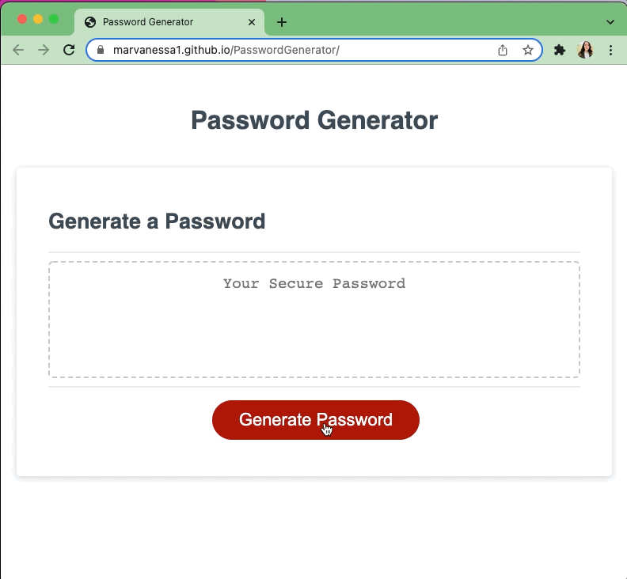

# PasswordGenerator
Application to let a user generate a password

## Description

This application lets a user create a password.  When running through the application, the user gets to choose password length between 8 to 128 characters and gets to select type(s) of characters to be included in their password: numeric, lower case, upper case, or special character.

The application runs through if and else conditional code statements to generate randomized values to be inlcuded in user password pool to then create one final password with randomized characters.

## Deployed Application
URL of deployed application [Password Generator] (https://marvanessa1.github.io/PasswordGenerator/).

## Password Generator Mock-Up

The screenshots below demonstrate the web application's appearence and funtionality:

Screenshot image

